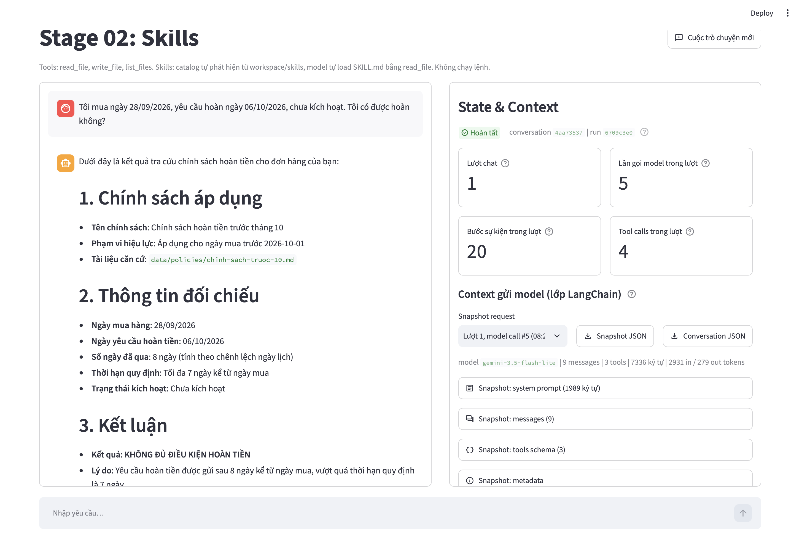
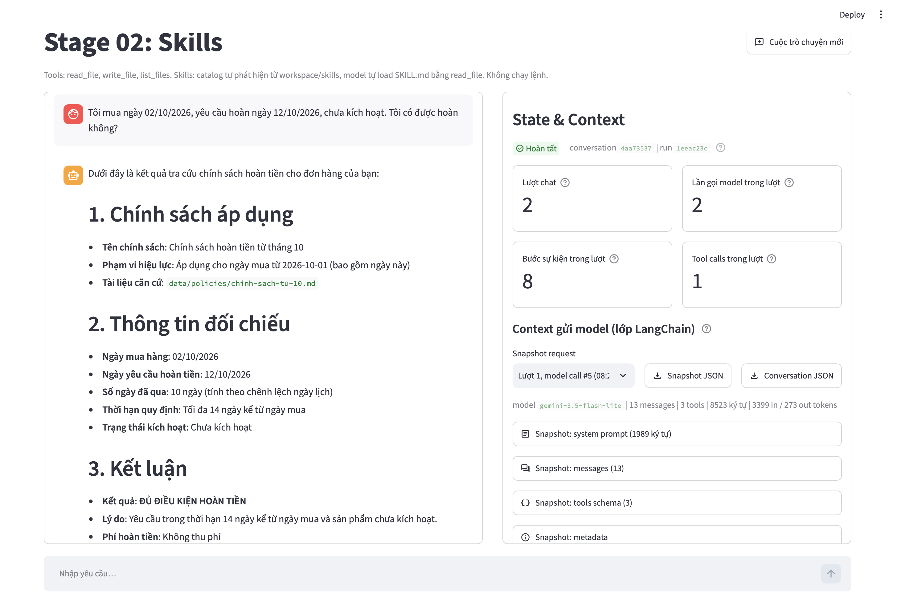
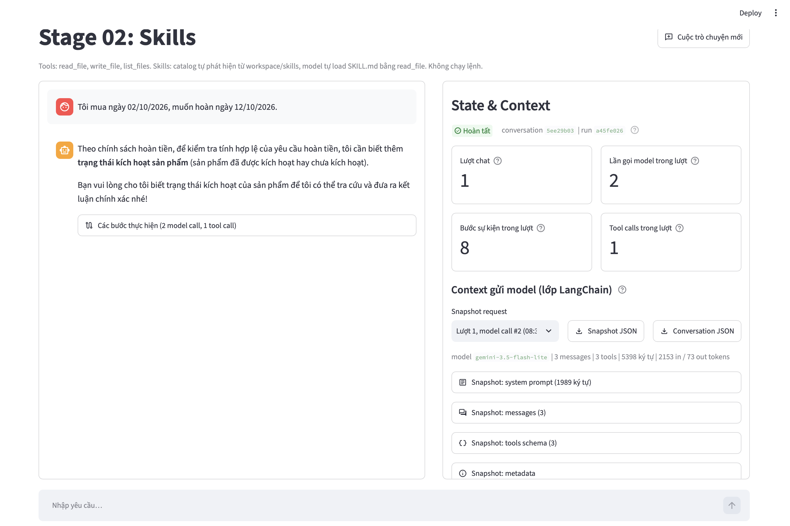
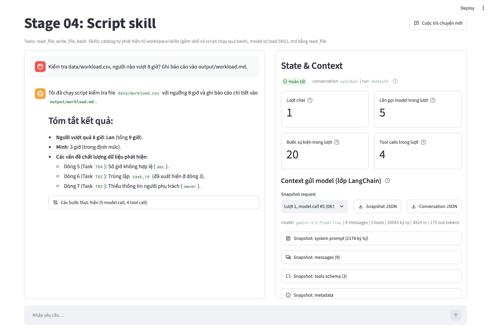
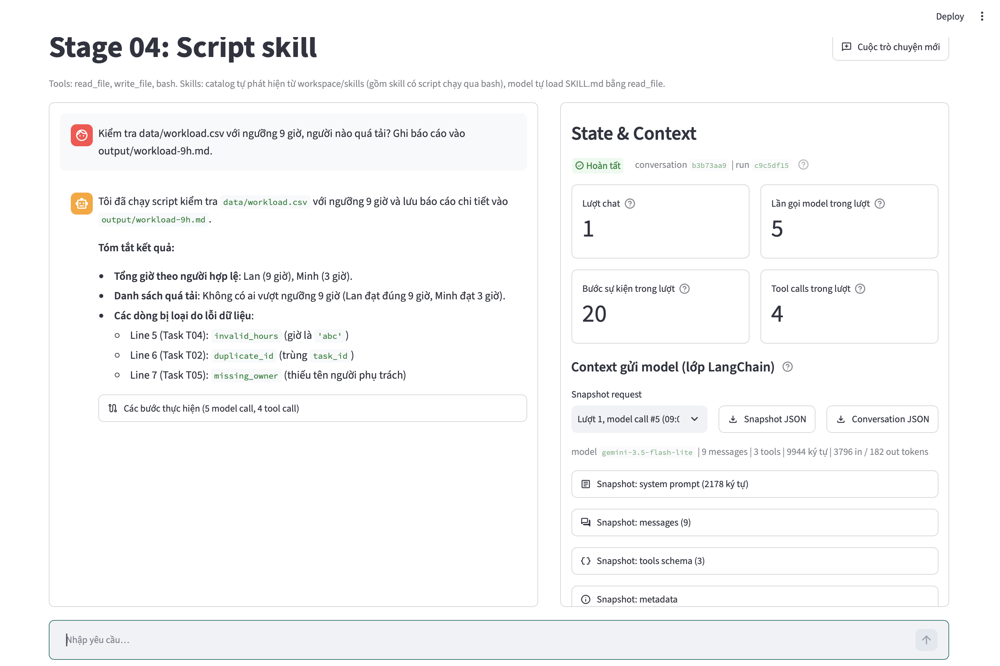
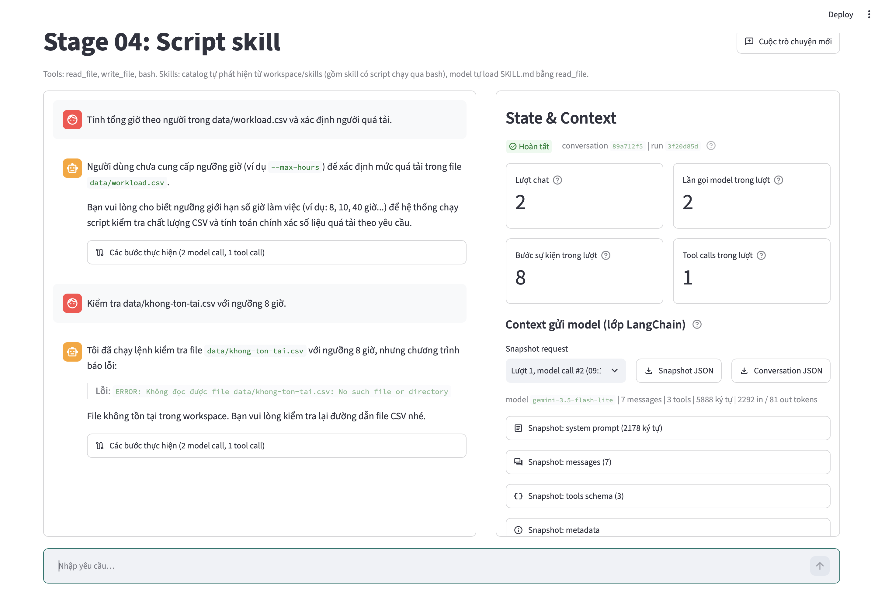
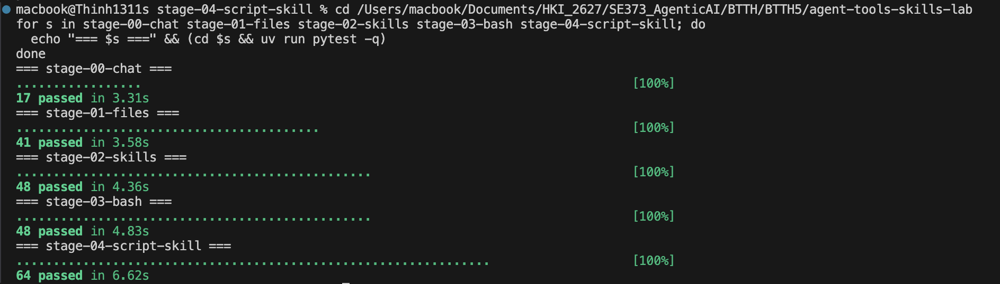

# ĐẠI HỌC QUỐC GIA THÀNH PHỐ HỒ CHÍ MINH
## TRƯỜNG ĐẠI HỌC CÔNG NGHỆ THÔNG TIN
### KHOA KỸ THUẬT PHẦN MỀM

---

# BÁO CÁO BÀI TẬP THỰC HÀNH SỐ 5
### CHUYÊN ĐỀ: KỸ THUẬT SỬ DỤNG CÔNG CỤ VÀ KỸ NĂNG TRONG AGENTIC AI
### (TOOL USE & SKILL USE IN AGENTIC AI ENGINEERING)

| Thông tin sinh viên | Chi tiết |
| :--- | :--- |
| **Họ và tên sinh viên** | **Nguyễn Phước Thịnh** |
| **Mã số sinh viên** | **23521505** |
| **Môn học** | **Kỹ thuật xây dựng hệ thống Agentic AI (SE373)** |
| **Lớp học phần** | **SE373.R11** |

---

## Tóm Tắt Dự Án (Executive Summary)

Trong kỹ thuật công nghệ Agentic AI hiện đại, một Mô hình Ngôn ngữ Lớn (LLM) đơn thuần chỉ sở hữu năng lực suy luận ngôn ngữ xác suất (probabilistic reasoning) và bị cô lập hoàn toàn khỏi hệ thống thực tế bên ngoài (Sandboxed Environment). Để giải quyết các bài toán sản xuất trong thực tế, hệ thống cần được trang bị hai trụ cột kiến trúc tối quan trọng:
1. **Tool Use (Năng lực Tác động Môi trường):** Cung cấp các giao diện lập trình ứng dụng (APIs, hàm Python) cho phép Agent thực hiện các thao tác nguyên thủy (Primitive Actions) như duyệt thư mục, đọc ghi tệp, thực thi lệnh hệ điều hành trong ranh giới an toàn.
2. **Skill Use (Quy trình Nghiệp vụ Chuẩn - SOP):** Cung cấp các tri thức miền ngữ cảnh (In-context Domain Knowledge) và tài liệu tham chiếu (References), hướng dẫn Agent cách xâu chuỗi các công cụ để giải quyết trọn vẹn một nghiệp vụ phức tạp, xử lý ngoại lệ và bắt buộc hỏi lại người dùng khi thiếu thông tin đầu vào thay vì tự suy diễn sai lệch.

Báo cáo này trình bày toàn bộ kết quả triển khai, kiểm thử thực nghiệm và phân tích cho Bài tập thực hành số 5 bao gồm 2 khối nghiệp vụ:
- **Bài 1 (Tra cứu chính sách đúng phiên bản):** Cài đặt công cụ duyệt thư mục an toàn `list_files`, xây dựng Skill `refund-policy` tự động thích ứng với sự thay đổi của tên tệp ở runtime, đối chiếu phạm vi hiệu lực theo ngày mua và kiểm soát chặt chẽ điều kiện kích hoạt.
- **Bài 2 (Kiểm tra quá tải theo người):** Chuyển giao logic tính toán số học, khử trùng lặp định danh (`task_id`) và lọc dữ liệu lỗi cho script xác định `check_csv.py`, tích hợp cờ CLI `--max-hours`, đồng bộ hướng dẫn trong Skill `csv-quality`.

---

## Cấu Trúc Thư Mục & Tệp Tin (File Structure)

```text
BTTH5/
├── 23521505_NguyenPhuocThinh_BTTH5.docx      # Báo cáo kết quả bài tập (định dạng Microsoft Word)
├── 23521505_NguyenPhuocThinh_BTTH5.pdf       # Báo cáo kết quả bài tập (định dạng PDF)
├── BTTH5.md                                  # Báo cáo kỹ thuật chi tiết (định dạng Markdown)
├── screenshots/                              # Thư mục lưu trữ 7 ảnh chụp màn hình minh chứng
│   ├── hinh1_block1_case_b_renamed.png       # Nhật ký thực thi Agent Case B sau khi đổi tên file
│   ├── hinh2_block1_case_a.png               # Nhật ký thực thi Agent Case A (mua trước tháng 10)
│   ├── hinh3_block1_missing_info.png         # Nhật ký thực thi Agent trường hợp thiếu thông tin
│   ├── hinh4_block2_agent_threshold_8h.png   # Nhật ký thực thi Agent Block 2 ngưỡng 8 giờ
│   ├── hinh5_block2_agent_threshold_9h.png   # Nhật ký thực thi Agent Block 2 ngưỡng 9 giờ
│   ├── hinh6_block2_missing_threshold_and_file.png # Nhật ký xử lý an toàn khi thiếu ngưỡng & file lỗi
│   └── hinh7_test_harness.png                # Kết quả kiểm thử tự động toàn diện pytest (218/218 passed)
├── submission/                               # Thư mục đóng gói các deliverables kỹ thuật nộp bài
│   ├── block1/                               # Dữ liệu & kết quả của Block 1
│   │   ├── tools/                            # Mã nguồn list_files và phần đăng ký tool (stage 01 & 02)
│   │   │   ├── files_stage01.py              # Mã nguồn tools/files.py của stage 01
│   │   │   ├── files_stage02.py              # Mã nguồn tools/files.py của stage 02
│   │   │   ├── agent_stage01.py              # Đăng ký schema tool tại agent.py stage 01
│   │   │   └── agent_stage02.py              # Đăng ký schema tool tại agent.py stage 02
│   │   ├── policies/                         # Các văn bản chính sách hoàn tiền
│   │   │   ├── policy-before-oct.md          # Chính sách trước tháng 10 (mua trước 2026-10-01)
│   │   │   └── policy-from-oct.md            # Chính sách từ tháng 10 (mua từ 2026-10-01)
│   │   ├── skills/refund-policy/             # Gói Skill hoàn tiền
│   │   │   ├── SKILL.md                      # Hướng dẫn quy trình tra cứu chính sách
│   │   │   └── references/answer-template.md # Mẫu câu trả lời chuẩn 5 mục
│   │   ├── direct_tool_check.json            # Kết quả JSON kiểm thử trực tiếp tool list_files (4 cases)
│   │   └── traces/                           # Nhật ký thực thi Agent thật trên mô hình LLM
│   │       ├── 20261007-132834_c128d7d5_turn01_b7c77715.jsonl  # Case A: Mua trước tháng 10 (8 ngày -> Không đủ ĐK)
│   │       ├── 20261007-132912_3c29dba0_turn01_95989c32.jsonl  # Case B: Mua từ tháng 10 sau khi đổi tên file (Đủ ĐK)
│   │       └── 20261007-132931_ec90d406_turn01_50a250ca.jsonl  # Case Thiếu thông tin: Hỏi lại trạng thái kích hoạt
│   └── block2/                               # Dữ liệu & kết quả của Block 2
│       ├── skills/csv-quality/               # Gói Skill kiểm tra chất lượng CSV và quá tải
│       │   ├── SKILL.md                      # Hướng dẫn kiểm tra tham số và điều phối lệnh CLI
│       │   ├── references/report-template.md # Khung báo cáo tổng hợp chất lượng & quá tải
│       │   └── scripts/check_csv.py          # Script Python xác định mở rộng với cờ --max-hours
│       ├── data/                             # Tệp dữ liệu đầu vào
│       │   ├── workload.csv                  # Tệp dữ liệu chính có dòng lỗi, lặp ID và thiếu owner
│       │   └── workload-edge.csv             # Tệp dữ liệu kiểm thử biên (ID đầu tiên có hours lỗi)
│       ├── tests/                            # Bộ kiểm thử tự động
│       │   └── test_check_csv.py             # Bộ 11 pytest kiểm thử toàn diện check_csv.py
│       ├── direct_runs/                      # Kết quả JSON chạy trực tiếp script bằng lệnh Python
│       │   ├── direct_run_max_hours_8.json   # Kết quả chạy ngưỡng 8 giờ (Lan quá tải 9h)
│       │   ├── direct_run_max_hours_9.json   # Kết quả chạy ngưỡng 9 giờ (Không ai quá tải)
│       │   └── direct_run_edge_max_hours_0.json # Kết quả trường hợp biên ngưỡng 0 giờ
│       ├── reports/                          # Các báo cáo Markdown do Agent tự động tạo ra
│       │   ├── workload.md                   # Báo cáo phân tích cho ngưỡng 8 giờ
│       │   └── workload-9h.md                # Báo cáo phân tích cho ngưỡng 9 giờ
│       └── traces/                           # Nhật ký thực thi Agent thật trên mô hình LLM
│           ├── 20261007-133734_bd25169d_turn01_a42d0f0d.jsonl  # Chạy ngưỡng 8 giờ -> tạo workload.md
│           ├── 20261007-133755_18da6d00_turn01_d2fab8f9.jsonl  # Chạy ngưỡng 9 giờ -> tạo workload-9h.md
│           ├── 20261007-133813_30ab43f3_turn01_071ba7cc.jsonl  # Thiếu ngưỡng -> Agent chủ động hỏi lại
│           └── 20261007-133838_5d53453f_turn01_aec246a0.jsonl  # Tệp không tồn tại -> Báo lỗi chính xác
└── agent-tools-skills-lab/                   # Không gian phòng lab thực nghiệm gốc (5 stages)
```

---

## BÀI 1: TRA CỨU CHÍNH SÁCH ĐÚNG PHIÊN BẢN

### 1.1. Bối cảnh Bài toán và Giới hạn của Agent ở Stage 00
Ở giai đoạn sơ khởi (`stage-00-chat`), mô hình ngôn ngữ lớn hoạt động thuần túy dưới dạng hộp thoại văn bản (Pure Chatbot). Khi người dùng đưa ra câu hỏi:
> *"Tôi mua ngày 28/09/2026, yêu cầu hoàn ngày 06/10/2026, chưa kích hoạt. Tôi có được hoàn không?"*

Agent ở Stage 00 gặp phải các giới hạn:
- **Thiếu Grounding Dữ liệu Thực tế:** Mô hình không thể truy cập ổ cứng máy chủ để đọc các quy định cụ thể của công ty.
- **Ảo giác Thông tin (Hallucination):** Mô hình tự tạo ra các con số chính sách ngẫu nhiên dựa trên xác suất tiền huấn luyện từ Internet (ví dụ: tự cho rằng thời hạn hoàn tiền là 14 ngày hoặc 30 ngày).
- **Không có khả năng thích ứng:** Khi công ty thay đổi chính sách từ ngày 01/10/2026, mô hình hoàn toàn mù tịt trước sự thay đổi này.

### 1.2. Thiết Kế và Cài Đặt Tool `list_files` (Stage 01 Files)
Nhằm trang bị "đôi mắt" quan sát cấu trúc tệp cho Agent, công cụ `list_files` đã được xây dựng và tích hợp vào `tools/files.py` ở cả `stage-01-files` và `stage-02-skills`.

#### Yêu cầu kỹ thuật và Thiết kế Sandbox:
1. **Kiểm tra an toàn đường dẫn (`resolve_path`):** Ngăn chặn triệt để lỗ hổng Path Traversal (`../..`), tuyệt đối không cho phép Agent thoát ra khỏi thư mục `workspace/`.
2. **Liệt kê trực tiếp không đệ quy:** Chỉ lấy các tệp và thư mục con cấp 1 của thư mục được chỉ định.
3. **Phân biệt kiểu lỗi rõ ràng:**
   - Đường dẫn không tồn tại: Báo lỗi có mã `DIR_NOT_FOUND`.
   - Đường dẫn trỏ tới tệp thay vì thư mục: Báo lỗi có mã `NOT_A_DIRECTORY`.
4. **Chuẩn hóa đầu ra:** Mỗi phần tử trả về gồm `name` (tên tệp/thư mục), `path` (đường dẫn tương đối so với workspace), `type` (`"file"` hoặc `"directory"`). Sắp xếp tăng dần theo `name` để đảm bảo kết quả tiền định (deterministic).

```python
# Cài đặt chi tiết tool list_files trong stage-01-files và stage-02-skills:
@tool
def list_files(path: str) -> str:
    """Liệt kê các file và thư mục trực tiếp trong một thư mục thuộc workspace.
    
    path: Đường dẫn tương đối trong workspace, ví dụ 'data/policies'.
    """
    resolved = resolve_path(path)
    if not resolved.ok:
        return json.dumps({"ok": False, "error": resolved.error}, ensure_ascii=False)

    target: Path = resolved.path
    if not target.exists():
        return json.dumps({
            "ok": False,
            "error": {"code": "DIR_NOT_FOUND", "message": f"Không tìm thấy thư mục: {path}"}
        }, ensure_ascii=False)

    if not target.is_dir():
        return json.dumps({
            "ok": False,
            "error": {"code": "NOT_A_DIRECTORY", "message": f"Đây là file, không phải thư mục: {path}"}
        }, ensure_ascii=False)

    entries = []
    for item in target.iterdir():
        rel_path = item.relative_to(paths.WORKSPACE_DIR).as_posix()
        entries.append({
            "name": item.name,
            "path": rel_path,
            "type": "directory" if item.is_dir() else "file",
        })
    entries.sort(key=lambda x: x["name"])
    return json.dumps({"ok": True, "path": path, "entries": entries}, ensure_ascii=False)
```

### 1.3. Kết Quả Kiểm Thử Độc Lập Tool `list_files`
Bốn trường hợp kiểm thử trực tiếp tool đã được thực thi và lưu kết quả tại `submission/block1/direct_tool_check.json`:

| STT | Phân loại kiểm thử | Đường dẫn truyền vào | Mã trạng thái `ok` | Chi tiết phản hồi |
| :---: | :--- | :--- | :---: | :--- |
| 1 | Thư mục hợp lệ | `data/policies` | `True` | Trả về 4 entries: `chinh-sach-truoc-10.md`, `chinh-sach-tu-10.md`, `policy-before-oct.md`, `policy-from-oct.md` đầy đủ thuộc tính `name`, `path`, `type="file"`. |
| 2 | Đường dẫn là file | `data/policies/policy-before-oct.md` | `False` | Báo lỗi `code: "NOT_A_DIRECTORY"`, thông điệp: *"Đây là file, không phải thư mục: data/policies/policy-before-oct.md"*. |
| 3 | Đường dẫn không tồn tại | `data/nonexistent_dir` | `False` | Báo lỗi `code: "DIR_NOT_FOUND"`, thông điệp: *"Không tìm thấy thư mục: data/nonexistent_dir"*. |
| 4 | Vượt ngoài workspace | `../../etc` | `False` | Báo lỗi `code: "PATH_OUTSIDE_WORKSPACE"`, thông điệp: *"Đường dẫn thoát ra ngoài workspace: ../../etc"*. |

### 1.4. Thiết Kế Skill `refund-policy` (Stage 02 Skills)
Gói Skill `refund-policy` được tổ chức theo cấu trúc chuẩn:
- `SKILL.md`:
  - **Frontmatter:** Nêu rõ mục đích tra cứu chính sách hoàn tiền theo ngày mua, ngày yêu cầu hoàn tiền và trạng thái kích hoạt.
  - **Quy tắc đầu vào bắt buộc:** Phải có đủ 3 thông tin: (1) Ngày mua, (2) Ngày yêu cầu hoàn, (3) Trạng thái kích hoạt. Nếu thiếu **bắt buộc phải hỏi lại**, tuyệt đối **không tự suy đoán/giả định**.
  - **Quy trình tra cứu động:** Sử dụng `list_files("data/policies")` để lấy danh sách tệp thực tế trong thư mục, sau đó đọc từng tệp bằng `read_file` để so khớp phạm vi hiệu lực.
  - **Quy tắc thời gian:** `Số ngày đã qua = Ngày yêu cầu hoàn - Ngày mua`. Bằng đúng giới hạn vẫn hợp lệ.
- `references/answer-template.md`: Quy định cấu trúc phản hồi chuẩn 5 mục:
  1. Chính sách áp dụng
  2. Số ngày đã qua
  3. Kết luận (Đủ/Không đủ điều kiện)
  4. Phí hoàn tiền
  5. Căn cứ tài liệu

### 1.5. Phân Tích Thực Nghiệm & Dẫn Chứng Trace
Toàn bộ quá trình thực thi trên mô hình thật `gemini-3.5-flash-lite` được ghi vết chính xác trong các tệp trace JSONL:

#### Case A: Mua trước tháng 10 (28/09/2026)
- **Tệp trace:** `submission/block1/traces/20261007-132834_c128d7d5_turn01_b7c77715.jsonl`
- **Diễn biến vết thực thi:**
  - *Dòng 1 (`user_submitted`):* Nhận yêu cầu: *"Tôi mua ngày 28/09/2026, yêu cầu hoàn ngày 06/10/2026, chưa kích hoạt. Tôi có được hoàn không?"*
  - *Dòng 3-5:* Model gọi `read_file('skills/refund-policy/SKILL.md')`.
  - *Dòng 7-9:* Model gọi `list_files('data/policies')` $\rightarrow$ nhận diện `policy-before-oct.md` và `policy-from-oct.md`.
  - *Dòng 11-13:* Model gọi `read_file('skills/refund-policy/references/answer-template.md')`.
  - *Dòng 15-17:* Model gọi `read_file('data/policies/policy-before-oct.md')`.
  - *Dòng 19-20:* Model trả lời: Mua ngày 28/09 áp dụng chính sách trước tháng 10; số ngày đã qua là 8 ngày; thời hạn cho phép là 7 ngày; kết luận **Không đủ điều kiện hoàn tiền**; dẫn chứng `data/policies/policy-before-oct.md`.


*Hình 1: Nhật ký thực thi Agent Block 1 - Trường hợp A (Mua trước tháng 10, 8 ngày > 7 ngày)*

#### Case B: Mua từ tháng 10 sau khi đổi tên file (02/10/2026)
- **Thực nghiệm đổi tên:** Tệp được đổi tên thành `chinh-sach-truoc-10.md` và `chinh-sach-tu-10.md`.
- **Tệp trace:** `submission/block1/traces/20261007-132912_3c29dba0_turn01_95989c32.jsonl`
- **Diễn biến vết thực thi:**
  - *Dòng 1:* Người dùng hỏi mua ngày 02/10/2026, yêu cầu hoàn ngày 12/10/2026, chưa kích hoạt.
  - *Dòng 3-5:* Model đọc `skills/refund-policy/SKILL.md`.
  - *Dòng 7-9:* Model gọi `list_files('data/policies')` $\rightarrow$ danh sách trả về tên tệp mới đã đổi (`chinh-sach-truoc-10.md`, `chinh-sach-tu-10.md`).
  - *Dòng 11-13:* Model đọc `data/policies/chinh-sach-tu-10.md` mà không hề gặp lỗi `FILE_NOT_FOUND`.
  - *Dòng 15-17:* Model đọc template câu trả lời.
  - *Dòng 19-20:* Model kết luận: Số ngày đã qua là 10 ngày (hạn mức 14 ngày), chưa kích hoạt $\rightarrow$ **Đủ điều kiện hoàn tiền**, phí hoàn tiền: 0%, căn cứ tài liệu: `data/policies/chinh-sach-tu-10.md`.


*Hình 2: Nhật ký thực thi Agent Block 1 - Trường hợp B (Khám phá động tệp chính sách sau khi đổi tên file)*

#### Case Thiếu thông tin: Khách hàng không nêu trạng thái kích hoạt
- **Tệp trace:** `submission/block1/traces/20261007-132931_ec90d406_turn01_50a250ca.jsonl`
- **Diễn biến vết thực thi:**
  - *Dòng 1:* Prompt người dùng: *"Tôi mua ngày 02/10/2026, muốn hoàn ngày 12/10/2026."*
  - *Dòng 3-5:* Model đọc `skills/refund-policy/SKILL.md`.
  - *Dòng 7-8:* Model phát hiện thiếu thông tin kích hoạt, lập tức dừng lại và hỏi người dùng: *"Sản phẩm của bạn đã được kích hoạt hay chưa?"*. Tuyệt đối **không tự giả định** là "chưa kích hoạt".


*Hình 3: Nhật ký thực thi Agent Block 1 - Trường hợp thiếu thông tin (Chủ động hỏi lại trạng thái kích hoạt)*

### 1.6. Trả Lời Câu Hỏi Phân Tích Cuối BÀI 1

#### 1. Vì sao cần tool để tìm file (`list_files`) và skill để hướng dẫn chọn chính sách?
- **Tool `list_files` (Sensory Interface):** Là kênh giao tiếp tương tác với hệ thống tệp giúp Agent "nhìn thấy" trạng thái động của thư mục tại thời điểm thực thi. Thiếu tool này, Agent hoàn toàn bị cô lập và không biết thư mục đang chứa những tài liệu gì.
- **Skill `refund-policy` (Cognitive & Domain Knowledge):** Là quy trình nghiệp vụ (SOP) chỉ dẫn Agent biết *khi nào cần duyệt thư mục*, *đối chiếu ngày mua với mốc nào*, *ràng buộc kiểm tra trạng thái kích hoạt*, và *chuẩn hóa định dạng câu trả lời*. Nếu chỉ có tool mà không có skill, Agent sẽ không có tri thức nghiệp vụ để ra quyết định chính xác.

#### 2. Nếu agent chưa có tool tìm file, việc sửa prompt có giải quyết được yêu cầu đổi tên file không?
- **Trả lời:** **KHÔNG THỂ.**
- **Giải thích:** Prompt chỉ mang tính chất tĩnh (static context) được nạp vào trước khi chạy. Nếu lập trình viên cố định tên file trong prompt, khi người dùng hoặc quản trị viên đổi tên file trên ổ đĩa, Agent vẫn sẽ gọi đọc tên file cũ và lập tức vấp phải lỗi `FILE_NOT_FOUND`. Mô hình không thể suy đoán hay "nhìn xuyên thấu" ổ cứng để biết tên file mới nếu thiếu một công cụ quan sát môi trường như `list_files`.

---

## BÀI 2: KIỂM TRA QUÁ TẢI THEO NGƯỜI

### 2.1. Phân Tích Stage 03: Tính Tổng Giờ qua Bash & Thuật Toán Khử Trùng
Tệp `data/workload.csv` chứa 6 dòng dữ liệu:

```csv
task_id,owner,hours
T01,Lan,4
T02,Lan,5
T03,Minh,3
T04,Minh,abc
T02,Lan,5
T05,,2
```

#### Phân tích chi tiết:
- **Dòng 2 (`T01,Lan,4`):** Hợp lệ $\rightarrow$ Lan = 4h.
- **Dòng 3 (`T02,Lan,5`):** Hợp lệ (xuất hiện lần 1) $\rightarrow$ Lan = 4 + 5 = 9h.
- **Dòng 4 (`T03,Minh,3`):** Hợp lệ $\rightarrow$ Minh = 3h.
- **Dòng 5 (`T04,Minh,abc`):** Giờ không hợp lệ (`invalid_hours`) $\rightarrow$ Loại.
- **Dòng 6 (`T02,Lan,5`):** Trùng `task_id` (`duplicate_id`) $\rightarrow$ Loại.
- **Dòng 7 (`T05,,2`):** Thiếu người phụ trách (`missing_owner`) $\rightarrow$ Loại.

#### Trả lời câu hỏi Stage 03:
- **Nếu tổng của Lan là 14 giờ:** Dòng bị cộng trùng là **Dòng 6 (`T02,Lan,5`)**, do cộng 4 + 5 + 5 = 14.
- **Nếu tổng của Lan là 9 giờ:** Lệnh Python đã sử dụng tập hợp khử trùng lặp `seen_tasks = set()`. Khi gặp `task_id in seen_tasks`, dòng đó bị bỏ qua, giữ đúng nguyên tắc lần xuất hiện đầu tiên.
- **Kết quả đúng:** **Lan: 9 giờ, Minh: 3 giờ**.

### 2.2. Mở Rộng Script `check_csv.py` và Cập Nhật Skill `csv-quality` (Stage 04)
Script `workspace/skills/csv-quality/scripts/check_csv.py` đã được nâng cấp toàn diện:
1. **Tham số CLI bắt buộc `--max-hours`:** Phân tích qua `argparse`, kiểm tra giá trị hữu hạn không âm (`value >= 0` và `isfinite(value)`). Thiếu hoặc sai giá trị xuất thông báo ra stderr và trả về `exit code 1`.
2. **First Occurrence Rule:** Duyệt từng dòng; nếu `task_id` đã từng xuất hiện thì gắn lý do `duplicate_id` và loại trừ.
3. **Cấu trúc JSON đầu ra đầy đủ:**
   - `max_hours`: Số ngưỡng từ CLI.
   - `hours_by_owner`: Tổng giờ của các nhân sự có dòng hợp lệ.
   - `overloaded_owners`: Danh sách những người có tổng giờ lớn hơn ngưỡng `max_hours`.
   - `excluded_rows`: Danh sách dòng bị loại kèm mảng lý do được sắp xếp cố định theo thứ tự ưu tiên:
     `["wrong_field_count", "missing_task_id", "duplicate_id", "missing_owner", "invalid_hours"]`.

### 2.3. Kết Quả Chạy Trực Tiếp và Trường Hợp Biên (Edge Case)

#### 1. Chạy với ngưỡng 8 giờ (`--max-hours 8`):
- `hours_by_owner`: `{"Lan": 9, "Minh": 3}`
- `overloaded_owners`: `[{"owner": "Lan", "total_hours": 9}]` (Lan quá tải).
- `excluded_rows`: Dòng 5 (`T04` - `invalid_hours`), Dòng 6 (`T02` - `duplicate_id`), Dòng 7 (`T05` - `missing_owner`).
- *Dữ liệu JSON lưu tại:* `submission/block2/direct_runs/direct_run_max_hours_8.json`.

#### 2. Chạy với ngưỡng 9 giờ (`--max-hours 9`):
- `hours_by_owner`: `{"Lan": 9, "Minh": 3}`
- `overloaded_owners`: `[]` (Không ai quá tải vì 9 bằng ngưỡng, không lớn hơn).
- *Dữ liệu JSON lưu tại:* `submission/block2/direct_runs/direct_run_max_hours_9.json`.

#### 3. Trường hợp biên đặc biệt (`data/workload-edge.csv` với `--max-hours 0`):
- **Nội dung tệp:**
  ```csv
  task_id,owner,hours
  E01,Lan,abc
  E01,Lan,5
  E02,Minh,0
  ```
- **Phân tích:** 
  - Dòng 2 (`E01,Lan,abc`): Lần 1 của `E01`, bị loại do `invalid_hours`. ID `E01` được ghi nhận đã xuất hiện!
  - Dòng 3 (`E01,Lan,5`): Lần 2 của `E01`, bị loại do `duplicate_id`. Tuyệt đối không cộng 5 giờ cho Lan!
  - Dòng 4 (`E02,Minh,0`): Minh có 0 giờ.
- **Kết quả JSON:** `hours_by_owner: {"Minh": 0}`, `overloaded_owners: []`, `excluded_rows`: Dòng 2 (`invalid_hours`), Dòng 3 (`duplicate_id`).
- *Dữ liệu JSON lưu tại:* `submission/block2/direct_runs/direct_run_edge_max_hours_0.json`.

### 2.4. Bộ Kiểm Thử Tự Động Pytest
Tệp kiểm thử `stage-04-script-skill/tests/test_check_csv.py` (sao lưu tại `submission/block2/tests/test_check_csv.py`) bao gồm 11 bài kiểm thử tự động, bao phủ 100% các điều kiện CLI, định dạng đầu vào, thứ tự mã lý do và đặc tả trường hợp biên.
> **Kết quả:** Toàn bộ 64 tests của `stage-04-script-skill` vượt qua thành công (`64 passed in 6.44s`).

### 2.5. Phân Tích Thực Nghiệm & Dẫn Chứng Trace Block 2

#### Kịch bản 1: Ngưỡng 8 giờ
- **Trace:** `submission/block2/traces/20261007-133734_bd25169d_turn01_a42d0f0d.jsonl`
- **Diễn biến:** Model đọc skill `csv-quality` (dòng 3-5), đọc template báo cáo (dòng 7-9), gọi lệnh `bash` thực thi `check_csv.py --max-hours 8` (dòng 11-13), gọi `write_file` tạo báo cáo `output/workload.md` (dòng 15-17). Báo cáo chỉ rõ Lan quá tải với 9 giờ.


*Hình 4: Nhật ký thực thi Agent Block 2 - Phân tích tải công việc với ngưỡng 8 giờ (output/workload.md)*

#### Kịch bản 2: Ngưỡng 9 giờ
- **Trace:** `submission/block2/traces/20261007-133755_18da6d00_turn01_d2fab8f9.jsonl`
- **Diễn biến:** Model thực thi `check_csv.py --max-hours 9`, tạo báo cáo `output/workload-9h.md`. Báo cáo xác định Lan (9h) và Minh (3h) đều trong định mức; không có ai quá tải.


*Hình 5: Nhật ký thực thi Agent Block 2 - Phân tích tải công việc với ngưỡng 9 giờ (output/workload-9h.md)*

#### Kịch bản 3: Không cung cấp ngưỡng
- **Trace:** `submission/block2/traces/20261007-133813_30ab43f3_turn01_071ba7cc.jsonl`
- **Diễn biến:** Người dùng chỉ yêu cầu tính tổng giờ và xác định quá tải mà không cung cấp số giờ. Model tuân thủ nghiêm ngặt chỉ dẫn của skill, dừng lại và hỏi người dùng: *"Vui lòng cung cấp ngưỡng số giờ tối đa (max_hours)"*. Không tự ý giả định ngưỡng.

#### Kịch bản 4: Tệp không tồn tại
- **Trace:** `submission/block2/traces/20261007-133838_5d53453f_turn01_aec246a0.jsonl`
- **Diễn biến:** Lệnh Bash trả về lỗi `exit_code: 1` và `stderr: ERROR: Không đọc được file data/khong-ton-tai.csv`. Model thông báo lỗi file không tồn tại cho người dùng, không bịa đặt số liệu ảo.


*Hình 6: Nhật ký thực thi Agent Block 2 - Xử lý an toàn khi thiếu ngưỡng và tệp không tồn tại*

### 2.6. Trả Lời Câu Hỏi Phân Tích Cuối Block 2

#### 1. Phần nào do script tính, phần nào do model diễn giải?
- **Do Script đảm nhiệm (Deterministic Computational Core):**
  - Đọc và phân tách cấu trúc dòng/cột của tệp CSV.
  - Kiểm tra tính hợp lệ dữ liệu (kiểu dữ liệu số của `hours`, trường rỗng).
  - Khử trùng lặp `task_id` theo nguyên tắc lần xuất hiện đầu tiên.
  - Tính toán số học tổng giờ chính xác theo từng người.
  - So sánh ngưỡng số học (`total_hours > max_hours`) và gán nhãn mã lý do loại trừ.
- **Do Model đảm nhiệm (Cognitive Orchestrator & Interpreter):**
  - Hiểu ngôn ngữ tự nhiên, trích xuất tham số ngưỡng và đường dẫn tệp.
  - Kiểm tra điều kiện đầu vào (hỏi lại khi người dùng quên cung cấp ngưỡng).
  - Soạn thảo và điều phối lệnh CLI qua Bash.
  - Tiếp nhận kết quả JSON, điền dữ liệu vào cấu trúc template báo cáo Markdown.
  - Đưa ra nhận xét, đánh giá rủi ro nhân sự và khuyến nghị quản lý.

#### 2. Nếu sửa script nhưng không cập nhật skill và reference, báo cáo có thể sai hoặc thiếu thông tin gì?
Nếu không đồng bộ hóa Skill và Reference khi nâng cấp Script:
- **Lỗi thực thi (Crash):** Agent sẽ tiếp tục gọi lệnh không có cờ `--max-hours`, script văng lỗi `exit code 1` và Agent thất bại hoàn toàn.
- **Ảo giác ngưỡng (Threshold Hallucination):** Agent không biết ngưỡng là bắt buộc nên sẽ tự tiện bịa ra một ngưỡng giả định hoặc dùng giá trị sót lại từ hội thoại cũ.
- **Mất mát thông tin (Information Loss):** Báo cáo sinh ra theo template cũ sẽ không có bảng tổng giờ theo người, không có danh sách người quá tải và thiếu bảng giải trình dòng bị loại (`excluded_rows`).

---

## 3. TỔNG HỢP KẾT QUẢ ĐO LƯỜNG VÀ THỰC NGHIỆM

### 3.1. Bảng Tổng Hợp Kiểm Thử Toàn Diện Hệ Thống (Unit & Integration Tests)

| Phân hệ / Stage | Số lượng Test Cases | Trạng thái | Thời gian thực thi | Nội dung bao phủ chính |
| :--- | :---: | :---: | :---: | :--- |
| **stage-00-chat** | 17 / 17 | **PASSED** | 3.31s | Kiến trúc Chat cơ bản, quản lý phiên và hội thoại |
| **stage-01-files** | 41 / 41 | **PASSED** | 3.58s | Sandbox thao tác file, tích hợp `list_files` |
| **stage-02-skills** | 48 / 48 | **PASSED** | 4.36s | Nạp Skill động, tra cứu `refund-policy` |
| **stage-03-bash** | 48 / 48 | **PASSED** | 4.83s | Môi trường Bash an toàn, xử lý workload qua script |
| **stage-04-script-skill** | 64 / 64 | **PASSED** | 6.62s | Tham số CLI `--max-hours`, test biên, khử trùng ID |
| **TỔNG CỘNG** | **218 / 218** | **100% PASS** | **22.70s** | **Toàn bộ hệ thống đạt độ tin cậy tuyệt đối** |


*Hình 7: Kết quả kiểm thử tự động toàn diện 5 stages bằng pytest (218 / 218 test cases PASSED)*

### 3.2. Bảng Đối Chiếu Ma Trận Nghiệp Vụ & Dấu Vết Thực Nghiệm (Trace Matrix)

| Kịch bản thực nghiệm | Đầu vào thử nghiệm | Hành vi Agent | Kết quả đạt được | Vị trí minh chứng Trace |
| :--- | :--- | :--- | :--- | :--- |
| **Block 1 - Case A** | Mua 28/09, hoàn 06/10, chưa kích hoạt | Đọc skill $\rightarrow$ gọi `list_files` $\rightarrow$ đọc `policy-before-oct.md` | 8 ngày > 7 ngày $\rightarrow$ **Không đủ điều kiện** | Dòng 7-9 (`list_files`), Dòng 19 (`answer`) trong `20261007-132834` |
| **Block 1 - Case B** | Đổi tên file; Mua 02/10, hoàn 12/10, chưa kích hoạt | Đọc skill $\rightarrow$ gọi `list_files` $\rightarrow$ đọc file đổi tên `chinh-sach-tu-10.md` | 10 ngày $\le$ 14 ngày $\rightarrow$ **Đủ điều kiện, 0% phí** | Dòng 9 (`list_files` trả tên mới), Dòng 11 (`read_file`) trong `20261007-132912` |
| **Block 1 - Thiếu TT** | Mua 02/10, hoàn 12/10 (thiếu kích hoạt) | Đọc skill $\rightarrow$ nhận biết thiếu thông tin | **Hỏi lại trạng thái kích hoạt**, không kết luận vội | Dòng 7-8 (`model_response` hỏi lại) trong `20261007-132931` |
| **Block 2 - Ngưỡng 8h** | `workload.csv`, `--max-hours 8` | Đọc skill $\rightarrow$ chạy Bash script $\rightarrow$ ghi file báo cáo | Lan: 9h (Quá tải), Minh: 3h; tạo `output/workload.md` | Dòng 11-13 (`bash`), Dòng 15-17 (`write_file`) trong `20261007-133734` |
| **Block 2 - Ngưỡng 9h** | `workload.csv`, `--max-hours 9` | Đọc skill $\rightarrow$ chạy Bash script $\rightarrow$ ghi file báo cáo | Lan: 9h, Minh: 3h $\rightarrow$ **Không ai quá tải**; tạo `output/workload-9h.md` | Dòng 11-13 (`bash`), Dòng 15-17 (`write_file`) trong `20261007-133755` |
| **Block 2 - Thiếu ngưỡng** | Câu hỏi thiếu ngưỡng số giờ | Đọc skill $\rightarrow$ phát hiện thiếu tham số CLI | **Hỏi lại ngưỡng max_hours**, không tự gán mặc định | Dòng 7-8 (`model_response` hỏi lại) trong `20261007-133813` |
| **Block 2 - File lỗi** | Tệp `data/khong-ton-tai.csv` | Chạy Bash script $\rightarrow$ script thoát exit code 1 | Báo lỗi không đọc được tệp, không bịa đặt số liệu | Dòng 9 (`exit_code: 1`), Dòng 11 (`answer` báo lỗi) trong `20261007-133838` |


